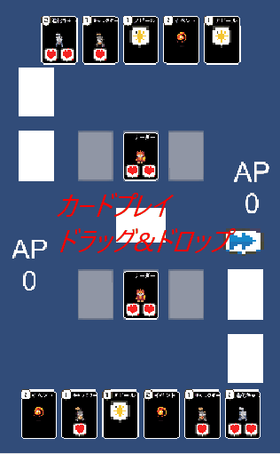

# Syupure(タイトル未決定)

## 概要

UnityとC#で開発中のオリジナル対戦カードゲームです。

リーダーカードとデッキを使って、相手より先に規定のアピールポイント獲得を目指します。

## 使用技術

* Unity(バージョン：2022.3.15)

* C#

* ピポヤの画像

## 実装済みの主な機能

** カードシステム: **

* 継承を用いたカード設計(リーダー、キャラクター、イベント、アピール、進化)

* ScriptableObjectによるカードデータ管理

** ゲームプレイ: **

* デッキからのランダムな手札配布

* カードのプレイ(コスト消費、ターン制約)

** 2種類のカード操作: **

* クリック → 拡大表示 → プレイボタン → ターゲット選択

* ドラッグ&ドロップ

* 配置ルールの実装(キャラクタースロット、呪文エリア)

* 進化システム(キャラクターへの重ね置き)

* アピールポイントシステム(リーダーとキャラクターのアピール力に基づくポイント加算)

* 基本的なターン進行

** UI: **

* 手札、フィールド、リーダーエリア、コスト、アピールポイント表示

* カードの拡大表示機能

## スクリーンショット / GIF

![カード拡大表示]

## 今後の実装予定

* 各種カード効果の実装
* 相手AIの実装
* UI/エフェクトの改善
