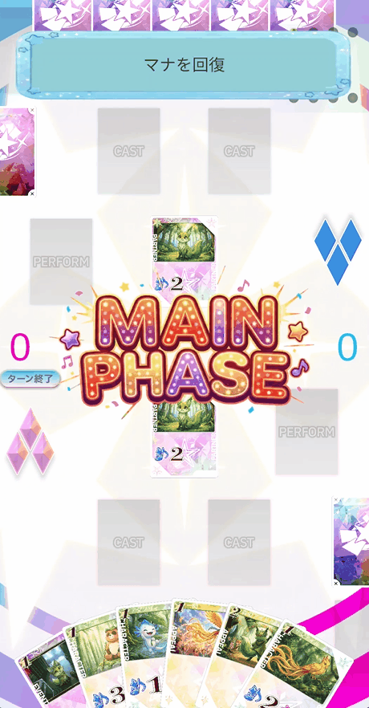

# スターライト

## 概要

UnityとC#で開発中のオリジナル対戦カードゲームです。

「相手を倒す」から「相手を越える」へ！
あなたとパートナーで魅せる新感覚カードゲーム

リーダーカードとデッキを使って、相手より先に規定のアピールポイント獲得を目指します。

## 使用技術

* Unity(バージョン：2022.3.15)

* C#

## 実装済みの主な機能

### カードシステム:

* 継承を用いたカード設計(リーダー、キャラクター、イベント、アピール、進化)

* ScriptableObjectによるカードデータ管理

### ゲームプレイ:

* デッキからのランダムな手札配布

* カードのプレイ(コスト消費、ターン制約)

### 2種類のカード操作:

* クリック → 拡大表示 → プレイボタン → ターゲット選択

* ドラッグ&ドロップ

* 配置ルールの実装(キャラクタースロット、呪文エリア)

* 進化システム(キャラクターへの重ね置き)

* アピールポイントシステム(リーダーとキャラクターのアピール力に基づくポイント加算)

* 基本的なターン進行

### 各種カード効果の実装:

* 発動タイミングの場合分けの実装

* カードごとの効果処理の実装

* 上記内容をCSV読み取りから適切な場合分け

### UI:

* 手札、フィールド、リーダーエリア、コスト、アピールポイント表示

* カードの拡大表示機能

### 相手AIの実装:

* ゲーム開始から終了までのAI処理実装

### デッキ作成モードの実装:

* リーダーカード選択画面とデッキ作成画面の実装

## スクリーンショット / GIF

## 今後の実装予定

* UI/エフェクトの改善

* ゲームBGM/SEの実装

## これまでの開発

* 学内でのチーム開発１（※非公開リポジトリ）
  * リザルト画面の作成
    * 3Dアニメーションの実装
    * UIの実装
  * ゲーム開始/終了時の演出作成

* 学内でのチーム開発２（※非公開リポジトリ）
  * 学内コンテスト銅賞受賞
  * レベルデザイン
    * ステージ作成
